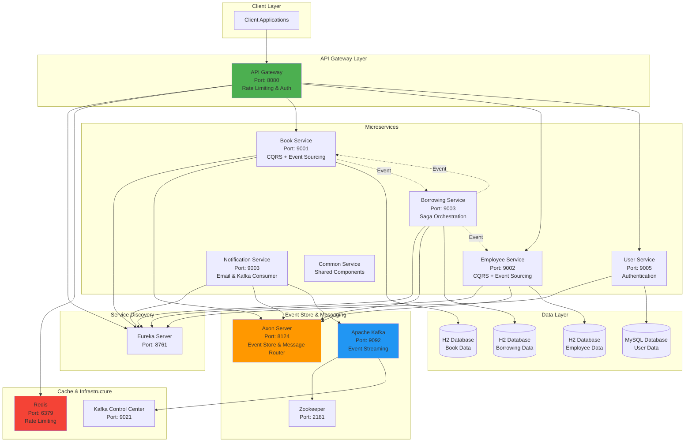

# 📚 Hệ Thống Quản Lý Thư Viện - Microservice Event Sourcing

## 📋 Tổng Quan Dự Án

Đây là một hệ thống quản lý thư viện được xây dựng theo kiến trúc **Microservices** kết hợp với **Event Sourcing** và **CQRS Pattern**. Hệ thống cho phép quản lý sách, nhân viên và quy trình mượn/trả sách với khả năng mở rộng cao và đảm bảo tính nhất quán dữ liệu phân tán thông qua **Saga Pattern**.

## 🏗️ Kiến Trúc Hệ Thống



## 🎯 Tính Năng Chính

### 📖 Quản Lý Sách (Book Service)

- ✅ Tạo mới sách với thông tin chi tiết (tên, tác giả)
- ✅ Cập nhật thông tin sách
- ✅ Xóa sách khỏi hệ thống
- ✅ Theo dõi trạng thái sẵn sàng của sách (có thể mượn/đang được mượn)
- ✅ Cập nhật trạng thái sách tự động khi có giao dịch mượn/trả
- ✅ Rollback trạng thái khi giao dịch thất bại

### 👥 Quản Lý Nhân Viên (Employee Service)

- ✅ Tạo hồ sơ nhân viên
- ✅ Cập nhật thông tin nhân viên
- ✅ Xóa nhân viên
- ✅ Theo dõi trạng thái kỷ luật của nhân viên
- ✅ Kiểm tra điều kiện mượn sách dựa trên trạng thái kỷ luật

### 📝 Quản Lý Mượn Sách (Borrowing Service)

- ✅ Tạo phiếu mượn sách mới
- ✅ Xác thực điều kiện mượn sách (sách có sẵn, nhân viên không bị kỷ luật)
- ✅ Quản lý quy trình mượn sách phức tạp với **Saga Pattern**
- ✅ Tự động rollback khi có lỗi xảy ra trong quá trình mượn
- ✅ Theo dõi lịch sử mượn/trả sách

### 🔐 Quản Lý Người Dùng (User Service)

- ✅ Xác thực và phân quyền người dùng
- ✅ Tích hợp với Keycloak OAuth2/JWT
- ✅ API công khai và API bảo mật

### 📧 Thông Báo (Notification Service)

- ✅ Gửi email thông báo
- ✅ Xử lý sự kiện từ Kafka
- ✅ Hỗ trợ template email với FreeMarker

## 🛠️ Tech Stack

### Backend Framework

- **Spring Boot 3.3.1** - Framework chính
- **Java 17** - Ngôn ngữ lập trình
- **Maven** - Build tool & dependency management

### Microservices Architecture

- **Spring Cloud Gateway** - API Gateway với rate limiting
- **Netflix Eureka** - Service discovery & registration
- **Spring Cloud OpenFeign** - Declarative REST client

### Event Sourcing & CQRS

- **Axon Framework 4.9.3** - Event sourcing, CQRS & Saga orchestration
- **Axon Server** - Event store & message routing

### Messaging & Streaming

- **Apache Kafka 7.7.0** - Event streaming platform
- **Spring Kafka** - Kafka integration
- **Zookeeper** - Kafka coordination

### Database

- **H2 Database** - In-memory database cho Book, Employee, Borrowing services
- **MySQL** - Persistent database cho User service
- **Spring Data JPA** - ORM framework

### Security

- **Spring Security OAuth2 Resource Server** - OAuth2 authentication
- **Keycloak** - Identity & access management
- **JWT** - Token-based authentication

### Caching & Rate Limiting

- **Redis** - Distributed cache & rate limiting
- **Spring Data Redis Reactive** - Reactive Redis integration

### Utilities

- **Lombok** - Reduce boilerplate code
- **Google Guava 33.2.1** - Core libraries
- **Bean Validation** - Input validation
- **FreeMarker** - Template engine cho email
- **Spring Mail** - Email sending

### API Documentation

- **SpringDoc OpenAPI 2.6.0** - API documentation (Swagger)

### DevOps

- **Docker & Docker Compose** - Containerization
- **Kubernetes** - Container orchestration (k8s deployment config)

## 📦 Cấu Trúc Dự Án

```
microservice-eventsourcing/
├── apigateway/              # API Gateway với rate limiting & routing
├── discoverserver/          # Eureka Service Discovery
├── bookservice/             # Service quản lý sách (CQRS)
│   ├── command/            # Command side (Create, Update, Delete)
│   │   ├── aggregate/      # BookAggregate - Event sourcing
│   │   ├── command/        # Commands
│   │   ├── controller/     # REST Controllers
│   │   └── event/          # Domain events
│   └── query/              # Query side (Read operations)
├── borrowingservice/        # Service quản lý mượn sách (Saga)
│   └── command/
│       ├── aggregate/      # BorrowingAggregate
│       ├── saga/           # BorrowingSaga - Distributed transaction
│       └── controller/     # REST Controllers
├── employeeservice/         # Service quản lý nhân viên (CQRS)
│   ├── command/            # Command side
│   └── query/              # Query side
├── userservice/             # Service xác thực người dùng
├── notificationservice/     # Service gửi thông báo
└── commonservice/           # Shared components
    ├── command/            # Shared commands
    ├── event/              # Shared events
    ├── model/              # Common models
    ├── queries/            # Shared queries
    └── services/           # Email & Kafka services
```

## 🚀 Hướng Dẫn Chạy Dự Án

### Yêu Cầu Hệ Thống

- Java 17 hoặc cao hơn
- Maven 3.6+
- Docker & Docker Compose
- 8GB RAM trở lên (khuyến nghị)

### Chạy Với Docker Compose

1. **Clone repository**

```bash
git clone <repository-url>
cd microservice-eventsourcing
```

2. **Build và chạy tất cả services**

```bash
# Set Docker username (optional)
export DOCKER_USERNAME=your-username

# Start infrastructure services first
docker-compose -f docker-compose-provider.yml up -d

# Start all microservices
docker-compose up -d
```

3. **Kiểm tra trạng thái services**

```bash
docker-compose ps
```

### Chạy Local Development

1. **Chạy infrastructure services**

```bash
docker-compose -f docker-compose-provider.yml up -d
```

2. **Chạy từng service theo thứ tự:**

```bash
# 1. Discovery Server
cd discoverserver
mvn spring-boot:run

# 2. Book Service
cd bookservice
mvn spring-boot:run

# 3. Employee Service
cd employeeservice
mvn spring-boot:run

# 4. Borrowing Service
cd borrowingservice
mvn spring-boot:run

# 5. User Service
cd userservice
mvn spring-boot:run

# 6. Notification Service
cd notificationservice
mvn spring-boot:run

# 7. API Gateway
cd apigateway
mvn spring-boot:run
```

## 🔗 Endpoints & Ports

| Service              | Port | URL                   | Mô Tả                            |
| -------------------- | ---- | --------------------- | -------------------------------- |
| API Gateway          | 8080 | http://localhost:8080 | Entry point cho tất cả requests  |
| Eureka Server        | 8761 | http://localhost:8761 | Service registry dashboard       |
| Book Service         | 9001 | http://localhost:9001 | CRUD operations cho sách         |
| Employee Service     | 9002 | http://localhost:9002 | CRUD operations cho nhân viên    |
| Borrowing Service    | 9003 | http://localhost:9003 | Quản lý mượn sách                |
| User Service         | 9005 | http://localhost:9005 | Authentication & user management |
| Notification Service | 9003 | http://localhost:9003 | Email notifications              |
| Axon Server          | 8024 | http://localhost:8024 | Axon dashboard                   |
| Axon Server (gRPC)   | 8124 | -                     | Event store communication        |
| Redis                | 6379 | -                     | Cache & rate limiting            |
| Kafka Broker         | 9092 | -                     | Message broker                   |
| Kafka Control Center | 9021 | http://localhost:9021 | Kafka monitoring                 |
| Zookeeper            | 2181 | -                     | Kafka coordination               |

## 📚 API Documentation

### Book Service APIs (qua API Gateway)

```
POST   /api/v1/books          - Tạo sách mới
PUT    /api/v1/books/{id}     - Cập nhật sách
DELETE /api/v1/books/{id}     - Xóa sách
GET    /api/v1/books          - Lấy danh sách sách
GET    /api/v1/books/{id}     - Lấy chi tiết sách
```

### Employee Service APIs (qua API Gateway)

```
POST   /api/v1/employees      - Tạo nhân viên mới
PUT    /api/v1/employees/{id} - Cập nhật nhân viên
DELETE /api/v1/employees/{id} - Xóa nhân viên
GET    /api/v1/employees      - Lấy danh sách nhân viên
GET    /api/v1/employees/{id} - Lấy chi tiết nhân viên
```

### Borrowing Service APIs

```
POST   /api/v1/borrowing      - Tạo phiếu mượn sách
```

### User Service APIs

```
GET    /api/v1/users/**       - User management (requires JWT)
GET    /api/v1/public/**      - Public endpoints
```

> **Lưu ý:** Tất cả requests đến Book và Employee services phải đi qua API Gateway và có rate limiting (10 requests/second, burst 20).

## 🔐 Authentication & Security

### Keycloak Configuration

- **Realm:** ltfullstack
- **Issuer URI:** http://localhost:8180/realms/ltfullstack
- **Import collection:** `KeyCloak.postman_collection.json`

### API Gateway Security

- **Rate Limiting:** Redis-based với 10 req/s, burst capacity 20
- **JWT Authentication:** Cho User Service endpoints
- **Key-based Auth:** Cho Book và Employee services

## 🎨 Các Pattern Được Sử Dụng

### 1. **CQRS (Command Query Responsibility Segregation)**

- Tách biệt Command (Write) và Query (Read) operations
- Áp dụng trong Book, Employee, và Borrowing services
- Command side xử lý business logic và tạo events
- Query side tối ưu cho việc đọc dữ liệu

### 2. **Event Sourcing**

- Lưu trữ tất cả thay đổi dưới dạng events trong Axon Server
- Có thể rebuild state từ event history
- Audit trail đầy đủ cho mọi thao tác

### 3. **Saga Pattern**

- Quản lý distributed transactions trong BorrowingSaga
- Đảm bảo tính nhất quán dữ liệu giữa các services
- Tự động rollback khi có lỗi

**Flow mượn sách:**

1. Tạo BorrowingCreatedEvent
2. Kiểm tra sách có sẵn không (BookService)
3. Cập nhật trạng thái sách (BookUpdateStatusEvent)
4. Kiểm tra nhân viên có bị kỷ luật không (EmployeeService)
5. Nếu thành công → Kết thúc Saga
6. Nếu thất bại → Rollback (BookRollBackStatusEvent, DeleteBorrowingCommand)

### 4. **API Gateway Pattern**

- Single entry point cho tất cả client requests
- Service routing, load balancing
- Cross-cutting concerns: authentication, rate limiting

### 5. **Service Discovery Pattern**

- Dynamic service registration với Eureka
- Client-side load balancing
- Health checking

## 📊 Database Schema

### Book Service (H2)

```sql
Book {
  id: String (PK)
  name: String
  author: String
  isReady: Boolean
}
```

### Employee Service (H2)

```sql
Employee {
  id: String (PK)
  firstName: String
  lastName: String
  isDisciplined: Boolean
}
```

### Borrowing Service (H2)

```sql
Borrowing {
  id: String (PK)
  bookId: String (FK)
  employeeId: String (FK)
  borrowingDate: Date
  returnDate: Date
}
```

## 🧪 Testing

### Postman Collection

Import `KeyCloak.postman_collection.json` để test các APIs với Keycloak authentication.

### H2 Console

Truy cập H2 console để xem database:

- Book Service: http://localhost:9001/h2-console
- Employee Service: http://localhost:9002/h2-console
- Borrowing Service: http://localhost:9003/h2-console

JDBC URL format: `jdbc:h2:mem:<serviceName>DB`

## 🐳 Docker & Kubernetes

### Docker Images

Mỗi service có Dockerfile riêng để build image.

### Kubernetes Deployment

File `k8s.deployment.yaml` chứa cấu hình deploy lên Kubernetes cluster.

## 📝 Logging & Monitoring

- **Slf4j + Logback** - Application logging
- **Axon Server Dashboard** - Event store monitoring
- **Kafka Control Center** - Kafka monitoring
- **Eureka Dashboard** - Service health monitoring

## 🤝 Contributing

Dự án này được phát triển cho mục đích giảng dạy trên Udemy. Mọi đóng góp và feedback đều được hoan nghênh!

## 📄 License

[Thêm thông tin license nếu cần]

## 👨‍💻 Author

**LTFullStack** - Udemy Instructor

---

**Lưu ý:** Đây là dự án demo cho mục đích học tập. Trong môi trường production, cần bổ sung thêm:

- Persistent databases thay vì H2 in-memory
- Comprehensive error handling & validation
- Security hardening
- Performance optimization
- Distributed tracing (Sleuth, Zipkin)
- Centralized logging (ELK Stack)
- Monitoring & alerting (Prometheus, Grafana)
