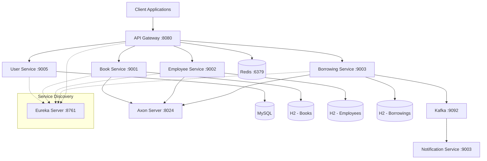
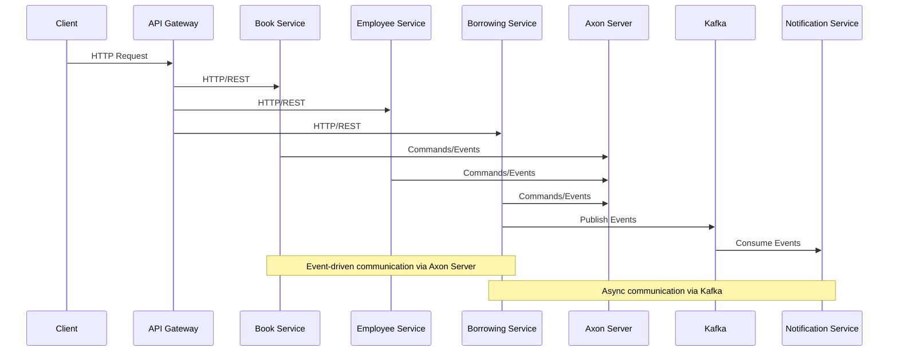
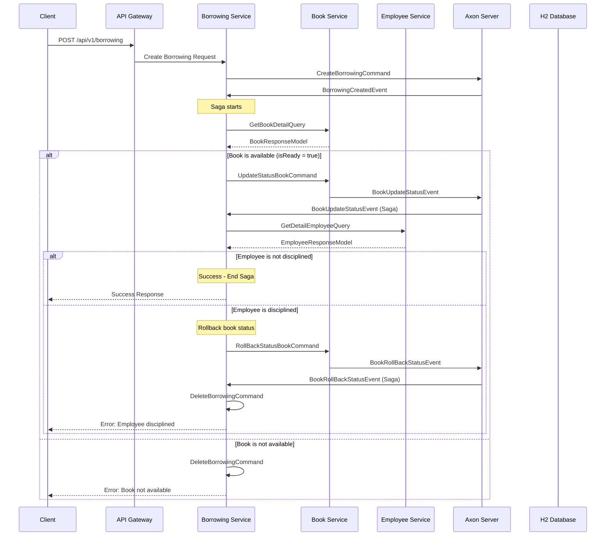
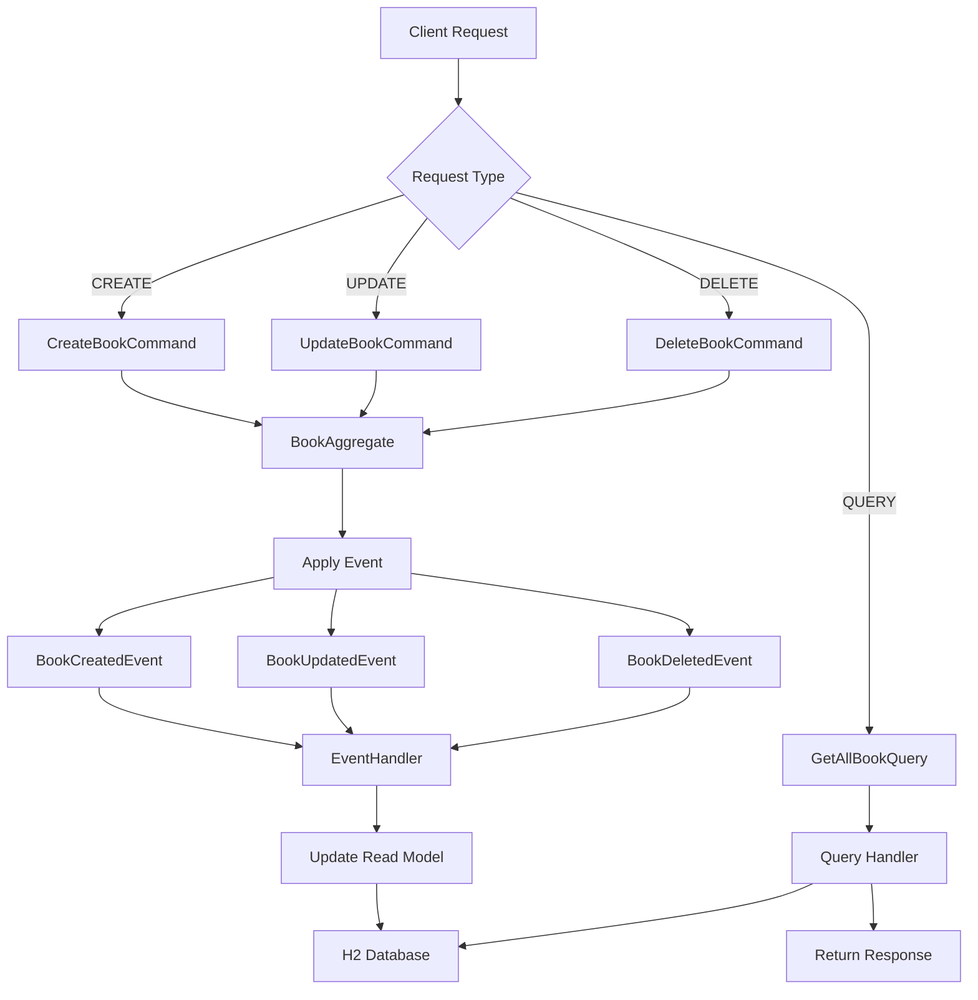
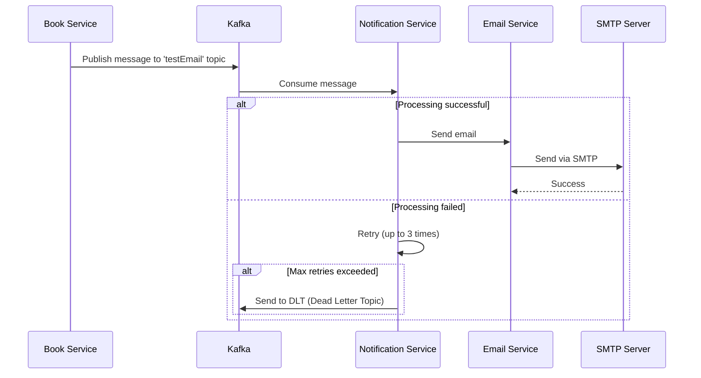

# Tài liệu khóa học: Thực chiến Microservice với Spring Boot và Event Sourcing

## Mục lục

1. [Tổng quan hệ thống](#1-tổng-quan-hệ-thống)
2. [Kiến trúc và công nghệ](#2-kiến-trúc-và-công-nghệ)
3. [Chi tiết từng service](#3-chi-tiết-từng-service)
4. [Luồng nghiệp vụ chính](#4-luồng-nghiệp-vụ-chính)
5. [Student Guide](#5-student-guide)
6. [Instructor Guide](#6-instructor-guide)

### 🎓 Đối Tượng Học Viên

| 👥 Đối Tượng | 📊 Level | 🎯 Mục Tiêu | 💼 Ứng Dụng |
|-------------|---------|------------|-------------|
| **Backend Developer** | Intermediate+ | Nâng cao kỹ năng Microservices | Senior Developer role |
| **Fullstack Developer** | Intermediate | Hiểu architecture phức tạp | Solution Architect |
| **DevOps Engineer** | Beginner+ | Container orchestration | Production deployment |
| **Tech Lead** | Advanced | System design patterns | Team leadership |
| **Students/Graduates** | Intermediate | Real-world experience | Industry readiness |

---

### 🛠️ Prerequisites & Preparation

#### ✅ Required Knowledge
| Technology     | Level        | Verification                                                      |
|----------------|--------------|-------------------------------------------------------------------|
| **Java**       | Intermediate | Can write classes, interfaces, generics, handle exceptions        |
| **Spring Boot**| Basic        | Can create REST controllers, use annotations, run application     |
| **REST APIs**  | Basic        | Understand HTTP methods, status codes                             |
| **Docker**     | Basic        | Can run containers, build images, basic commands                  |
| **Git**        | Basic        | Clone, commit, push operations                                    |


#### 🚀 Recommended Setup
```bash
# Environment Check
java --version          # v17+ required
maven --version           # v3.6+ required  
docker --version        # v20+ recommended
git --version           # v2.30+ recommended
```
---

## 📌 Tương tác với Giảng viên

Khóa học không chỉ dừng lại ở video lý thuyết – bạn sẽ luôn có **sự đồng hành trực tiếp từ giảng viên** trong suốt quá trình học.

### 💬 Hỏi – Đáp nhanh chóng
- Đặt câu hỏi trực tiếp bên dưới mỗi bài học hoặc trong mục Q&A.
- Nhận phản hồi nhanh chóng và giải thích rõ ràng từ khái niệm cơ bản đến kỹ thuật nâng cao.

### 🛠 Hỗ trợ xử lý lỗi
- Mô tả vấn đề và đính kèm code khi gặp lỗi.
- Giảng viên sẽ hướng dẫn từng bước để khắc phục và giải thích nguyên nhân.

### 🤝 Trao đổi cùng cộng đồng học viên
- Tham gia **group riêng** để thảo luận, chia sẻ kinh nghiệm và học hỏi lẫn nhau.
- Kết nối với các học viên khác đang làm trong ngành.
  
### 🌐 Liên hệ & Kết nối
Nếu bạn cần hỗ trợ hoặc muốn kết nối thêm ngoài khóa học, có thể liên hệ qua:

- 📧 **Email:** [dotanthanhvlog@gmail.com](mailto:dotanthanhvlog@gmail.com)  
- 💼 **LinkedIn:** [https://www.linkedin.com/in/thanh270600/](https://www.linkedin.com/in/thanh270600/)  
- 🐙 **GitHub:** [https://github.com/thanhmati](https://github.com/thanhmati)  
- 📺 **YouTube:** [https://www.youtube.com/@laptrinhfullstack](https://www.youtube.com/@laptrinhfullstack)  
- 💬 **Facebook Group:** [https://www.facebook.com/groups/ltfullstack](https://www.facebook.com/groups/ltfullstack)
- 📞 **Zalo** 0762216048 


> 💡 **Phương châm:** *“Học thật – Làm thật”*  
Giảng viên sẽ luôn theo sát để bạn không chỉ **hoàn thành khóa học**, mà còn **tự tin triển khai dự án thực tế**.


---

## 1. Tổng quan hệ thống

### 1.1. Giới thiệu dự án

Hệ thống **Library Management System** là một ứng dụng quản lý thư viện được xây dựng theo kiến trúc **Microservices** kết hợp với **Event Sourcing** pattern. Hệ thống cho phép quản lý sách, nhân viên, người dùng và quy trình mượn/trả sách.

### 1.2. Danh sách các service và vai trò

| Service | Port | Vai trò | Database | Event Sourcing |
|---------|------|---------|----------|----------------|
| **Discovery Server** | 8761 | Service Registry (Eureka) | - | ❌ |
| **API Gateway** | 8080 | API Gateway, Load Balancer, Authentication | Redis (Cache) | ❌ |
| **Book Service** | 9001 | Quản lý sách (CRUD + Status) | H2 (In-memory) | ✅ |
| **User Service** | 9005 | Quản lý người dùng | MySQL | ❌ |
| **Employee Service** | 9002 | Quản lý nhân viên | H2 (In-memory) | ✅ |
| **Borrowing Service** | 9003 | Quản lý mượn sách (Saga) | H2 (In-memory) | ✅ |
| **Notification Service** | 9003 | Gửi thông báo qua email/Kafka | - | ❌ |
| **Common Service** | - | Shared components, Events, Commands | - | ❌ |

### 1.3. Kiến trúc tổng thể



---

## 2. Kiến trúc và công nghệ

### 2.1. Công nghệ chính được sử dụng

#### **Framework & Libraries**
- **Spring Boot 3.3.1** - Framework chính
- **Spring Cloud 2023.0.2** - Microservices ecosystem
- **Axon Framework 4.9.3** - Event Sourcing & CQRS
- **Spring Cloud Gateway** - API Gateway
- **Spring Cloud Netflix Eureka** - Service Discovery

#### **Database & Storage**
- **H2 Database** - In-memory database cho Book, Employee, Borrowing
- **MySQL** - Database cho User service
- **Redis** - Caching và Rate limiting
- **Axon Server** - Event Store

#### **Message Broker & Communication**
- **Apache Kafka** - Event streaming
- **OpenFeign** - Inter-service communication
- **REST APIs** - HTTP communication

#### **Security & Monitoring**
- **OAuth2 Resource Server** - Authentication
- **Keycloak** - Identity Provider
- **Spring Boot Actuator** - Monitoring

### 2.2. Patterns được áp dụng

#### **Microservice Patterns**
- **API Gateway Pattern** - Centralized entry point
- **Service Registry Pattern** - Service discovery với Eureka
- **Database per Service** - Mỗi service có database riêng

#### **Event-Driven Patterns**
- **Event Sourcing** - Lưu trữ events thay vì state
- **CQRS (Command Query Responsibility Segregation)** - Tách biệt Command và Query
- **Saga Pattern** - Distributed transaction management
- **Event-Driven Architecture** - Communication qua events

#### **Resilience Patterns**
- **Circuit Breaker** - Fault tolerance
- **Rate Limiting** - API protection
- **Retry Pattern** - Error recovery

### 2.3. Cách các service giao tiếp



---

## 3. Chi tiết từng service

### 3.1. Discovery Server (Eureka Server)

#### **Chức năng**
- Service Registry cho tất cả microservices
- Health checking và load balancing
- Service discovery tự động

#### **Configuration**
```yaml
server:
  port: 8761

eureka:
  instance:
    hostname: localhost
  client:
    register-with-eureka: false
    fetch-registry: false
    service-url:
      defaultZone: http://localhost:8761/eureka
```

#### **Dependencies chính**
- `spring-cloud-starter-netflix-eureka-server`

---

### 3.2. API Gateway

#### **Chức năng**
- Single entry point cho tất cả client requests
- Load balancing và service routing
- Rate limiting với Redis
- Authentication với JWT/OAuth2
- Request/Response filtering

#### **API Routes Configuration**
```yaml
spring:
  cloud:
    gateway:
      routes:
        - id: bookservice
          uri: lb://bookservice
          predicates:
            - Path=/api/v1/books/**
          filters:
            - name: RequestRateLimiter
              args:
                redis-rate-limiter.replenishRate: 10
                redis-rate-limiter.burstCapacity: 20
            - KeyAuthFilter
        - id: userservice
          uri: http://localhost:9005
          predicates:
            - Path=/api/v1/users/**
          filters:
            - name: JwtHeaderFilter
```

#### **Security Configuration**
- **OAuth2 Resource Server** với Keycloak
- **JWT Token validation**
- **Rate limiting** với Redis backend

#### **Dependencies chính**
- `spring-cloud-starter-gateway`
- `spring-boot-starter-data-redis-reactive`
- `spring-boot-starter-oauth2-resource-server`

---

### 3.3. Book Service

#### **Chức năng**
- Quản lý thông tin sách (CRUD operations)
- Quản lý trạng thái sách (available/borrowed)
- Implement Event Sourcing với Axon Framework
- Support CQRS pattern

#### **Domain Model**
```java
@Entity
@Table(name = "books")
public class Book {
    @Id
    private String id;
    private String name;
    private String author;
    private Boolean isReady; // Trạng thái sách
}
```

#### **API Endpoints**

| Method | Endpoint | Description | Request Body |
|--------|----------|-------------|--------------|
| GET | `/api/v1/books` | Lấy danh sách tất cả sách | - |
| GET | `/api/v1/books/{bookId}` | Lấy chi tiết một sách | - |
| POST | `/api/v1/books` | Tạo sách mới | `BookRequestModel` |
| PUT | `/api/v1/books/{bookId}` | Cập nhật sách | `BookRequestModel` |
| DELETE | `/api/v1/books/{bookId}` | Xóa sách | - |

#### **Event Sourcing Implementation**

**Commands:**
- `CreateBookCommand` - Tạo sách mới
- `UpdateBookCommand` - Cập nhật sách
- `DeleteBookCommand` - Xóa sách
- `UpdateStatusBookCommand` - Cập nhật trạng thái sách
- `RollBackStatusBookCommand` - Rollback trạng thái sách

**Events:**
- `BookCreatedEvent` - Sách được tạo
- `BookUpdatedEvent` - Sách được cập nhật
- `BookDeletedEvent` - Sách được xóa
- `BookUpdateStatusEvent` - Trạng thái sách được cập nhật
- `BookRollBackStatusEvent` - Trạng thái sách được rollback

**Aggregate:**
```java
@Aggregate
public class BookAggregate {
    @AggregateIdentifier
    private String id;
    private String name;
    private String author;
    private Boolean isReady;

    @CommandHandler
    public BookAggregate(CreateBookCommand command) {
        BookCreatedEvent event = new BookCreatedEvent();
        BeanUtils.copyProperties(command, event);
        AggregateLifecycle.apply(event);
    }

    @EventSourcingHandler
    public void on(BookCreatedEvent event) {
        this.id = event.getId();
        this.name = event.getName();
        this.author = event.getAuthor();
        this.isReady = event.getIsReady();
    }
}
```

#### **Database Configuration**
```properties
spring.datasource.url=jdbc:h2:mem:bookDB
spring.datasource.driverClassName=org.h2.Driver
spring.jpa.hibernate.ddl-auto=update
axon.axonserver.servers=axonserver:8124
```

---

### 3.4. User Service

#### **Chức năng**
- Quản lý thông tin người dùng
- Integration với Keycloak cho authentication
- Traditional CRUD operations (không dùng Event Sourcing)

#### **Domain Model**
```java
@Entity
@Table(name = "users")
public class User {
    @Id
    @GeneratedValue(strategy = GenerationType.IDENTITY)
    private Long id;
    
    @Column(name = "user_id")
    private String userId;
    
    @Column(unique = true, nullable = false)
    private String email;
    
    private String username;
    private String firstName;
    private String lastName;
    private LocalDate dob;
    private String name;
}
```

#### **API Endpoints**
| Method | Endpoint | Description |
|--------|----------|-------------|
| GET | `/api/v1/users` | Lấy danh sách users |
| POST | `/api/v1/users` | Tạo user mới |
| GET | `/api/v1/public/test` | Public endpoint |

#### **Database Configuration**
```yaml
spring:
  datasource:
    url: jdbc:mysql://localhost:3306/ltfullstack
    username: root
    password:
  jpa:
    hibernate:
      ddl-auto: update
    properties:
      hibernate:
        dialect: org.hibernate.dialect.MySQL8Dialect
```

#### **Keycloak Integration**
```yaml
idp:
  url: http://localhost:8180
  client-id: ltfullstack_app
  client-secret: iwz9xprfV78ltEcWBDqH8pn5VMTx1EtF
  realm: ltfullstack
```

---

### 3.5. Employee Service

#### **Chức năng**
- Quản lý thông tin nhân viên thư viện
- Quản lý trạng thái kỷ luật nhân viên
- Implement Event Sourcing với Axon Framework

#### **Domain Model**
```java
@Aggregate
public class EmployeeAggregate {
    @AggregateIdentifier
    private String id;
    private String firstName;
    private String lastName;
    private String kin; // Thông tin thân nhân
    private Boolean isDisciplined; // Trạng thái kỷ luật
}
```

#### **Commands & Events**
- **Commands:** `CreateEmployeeCommand`, `UpdateEmployeeCommand`, `DeleteEmployeeCommand`
- **Events:** `EmployeeCreatedEvent`, `EmployeeUpdatedEvent`, `EmployeeDeletedEvent`

#### **API Endpoints**
| Method | Endpoint | Description |
|--------|----------|-------------|
| GET | `/api/v1/employees` | Lấy danh sách nhân viên |
| GET | `/api/v1/employees/{employeeId}` | Lấy chi tiết nhân viên |
| POST | `/api/v1/employees` | Tạo nhân viên mới |
| PUT | `/api/v1/employees/{employeeId}` | Cập nhật nhân viên |
| DELETE | `/api/v1/employees/{employeeId}` | Xóa nhân viên |

---

### 3.6. Borrowing Service

#### **Chức năng**
- Quản lý quy trình mượn sách
- Implement **Saga Pattern** cho distributed transactions
- Coordinate giữa Book Service và Employee Service
- Handle compensating transactions

#### **Domain Model**
```java
@Aggregate
public class BorrowingAggregate {
    @AggregateIdentifier
    private String id;
    private String bookId;
    private String employeeId;
    private Date borrowingDate;
    private Date returnDate;
}
```

#### **Saga Implementation**
```java
@Saga
public class BorrowingSaga {
    
    @StartSaga
    @SagaEventHandler(associationProperty = "id")
    private void handle(BorrowingCreatedEvent event) {
        // 1. Kiểm tra sách có available không
        // 2. Update trạng thái sách thành "borrowed"
        // 3. Kiểm tra nhân viên có bị kỷ luật không
        // 4. Rollback nếu có lỗi
    }
    
    @SagaEventHandler(associationProperty = "bookId")
    private void handler(BookUpdateStatusEvent event) {
        // Kiểm tra nhân viên sau khi book status được update
    }
    
    @SagaEventHandler(associationProperty = "bookId")
    private void handle(BookRollBackStatusEvent event) {
        // Rollback borrowing record nếu có lỗi
    }
}
```

#### **API Endpoints**
| Method | Endpoint | Description |
|--------|----------|-------------|
| POST | `/api/v1/borrowing` | Tạo yêu cầu mượn sách |

#### **Business Rules**
1. Sách phải có trạng thái `isReady = true`
2. Nhân viên không được trong trạng thái kỷ luật (`isDisciplined = false`)
3. Nếu vi phạm rule nào, saga sẽ rollback toàn bộ transaction

---

### 3.7. Notification Service

#### **Chức năng**
- Nhận events từ Kafka
- Gửi email notifications
- Retry mechanism với DLT (Dead Letter Topic)

#### **Kafka Consumer Implementation**
```java
@Component
public class EventConsumer {
    
    @RetryableTopic(
        attempts = "4",
        backoff = @Backoff(delay = 1000, multiplier = 2),
        autoCreateTopics = "true",
        dltStrategy = DltStrategy.FAIL_ON_ERROR
    )
    @KafkaListener(topics = "testEmail")
    public void testEmail(String message) {
        // Send email notification
        emailService.sendEmail(message, "Subject", htmlTemplate, true, null);
    }
    
    @DltHandler
    void processDltMessage(@Payload String message) {
        log.info("DLT receive message: " + message);
    }
}
```

#### **Email Service Features**
- HTML email templates với FreeMarker
- Attachment support
- Template-based email generation

---

### 3.8. Common Service

#### **Chức năng**
- Shared DTOs, Events, Commands
- Common services (Email, Kafka)
- Configuration classes
- Cross-cutting concerns

#### **Shared Components**
- **Events:** `BookUpdateStatusEvent`, `BookRollBackStatusEvent`
- **Commands:** `UpdateStatusBookCommand`, `RollBackStatusBookCommand`
- **Services:** `EmailService`, `KafkaService`
- **Models:** `BookResponseCommonModel`, `EmployeeResponseCommonModel`

#### **Kafka Configuration**
```java
@Configuration
public class KafkaConfig {
    @Bean
    public ProducerFactory<String, String> producerFactory() {
        Map<String, Object> configProps = new HashMap<>();
        configProps.put(ProducerConfig.BOOTSTRAP_SERVERS_CONFIG, bootstrapServers);
        configProps.put(ProducerConfig.KEY_SERIALIZER_CLASS_CONFIG, StringSerializer.class);
        configProps.put(ProducerConfig.VALUE_SERIALIZER_CLASS_CONFIG, StringSerializer.class);
        return new DefaultKafkaProducerFactory<>(configProps);
    }
}
```

---

## 4. Luồng nghiệp vụ chính

### 4.1. Luồng mượn sách (Borrowing Flow)

Đây là luồng nghiệp vụ phức tạp nhất, thể hiện rõ **Saga Pattern** và **Event Sourcing**:



#### **Chi tiết các bước:**

1. **Khởi tạo Borrowing:**
   - Client gửi request tạo borrowing với `bookId` và `employeeId`
   - `BorrowingAggregate` tạo `BorrowingCreatedEvent`
   - Saga được start với event này

2. **Kiểm tra Book availability:**
   - Saga query BookService để lấy thông tin sách
   - Nếu `book.isReady = false`, rollback borrowing và kết thúc

3. **Update Book status:**
   - Nếu sách available, gửi `UpdateStatusBookCommand` để set `isReady = false`
   - BookService phát ra `BookUpdateStatusEvent`

4. **Kiểm tra Employee status:**
   - Saga query EmployeeService để kiểm tra `isDisciplined`
   - Nếu nhân viên bị kỷ luật, thực hiện compensating transaction

5. **Compensating Transaction:**
   - Gửi `RollBackStatusBookCommand` để reset book status
   - Xóa borrowing record
   - End saga với failure

6. **Success case:**
   - Tất cả checks pass, borrowing thành công
   - End saga

### 4.2. Luồng quản lý sách (Book Management Flow)



### 4.3. Luồng gửi notification



---

## 5. Student Guide

### 5.1. Kiến thức cần chuẩn bị

#### **Cơ bản**
- Java 17+ và Spring Boot fundamentals
- REST API design và HTTP protocol
- Database basics (SQL, JPA/Hibernate)
- Maven và dependency management

#### **Trung cấp**
- Spring Cloud ecosystem (Gateway, Eureka, OpenFeign)
- Docker và containerization
- Message queues (Apache Kafka)
- Microservices patterns

#### **Nâng cao**
- Event Sourcing và CQRS concepts
- Distributed systems challenges
- Saga Pattern cho distributed transactions
- OAuth2 và JWT authentication

### 5.2. Hướng dẫn setup môi trường

#### **Bước 1: Setup Infrastructure**
```bash
# Clone repository
git clone <repository-url>
cd microservice-library-system

# Start infrastructure services
docker-compose up -d axonserver redis zookeeper broker control-center
```

#### **Bước 2: Setup Keycloak**
```bash
# Import Keycloak configuration
# File: KeyCloak.postman_collection.json chứa config cần thiết
```

#### **Bước 3: Start Services**
```bash
# Start discovery server first
cd discoverserver && mvn spring-boot:run

# Start other services
cd bookservice && mvn spring-boot:run
cd userservice && mvn spring-boot:run
cd employeeservice && mvn spring-boot:run
cd borrowingservice && mvn spring-boot:run
cd notificationservice && mvn spring-boot:run
cd apigateway && mvn spring-boot:run
```

### 5.3. Thực hành từng bước

#### **Lab 1: Tạo và Query Books**
```bash
# Tạo sách mới
curl -X POST http://localhost:8080/api/v1/books \
  -H "Content-Type: application/json" \
  -d '{
    "name": "Spring Boot in Action",
    "author": "Craig Walls",
    "isReady": true
  }'

# Lấy danh sách sách
curl http://localhost:8080/api/v1/books
```

#### **Lab 2: Tạo Employee**
```bash
curl -X POST http://localhost:8080/api/v1/employees \
  -H "Content-Type: application/json" \
  -d '{
    "firstName": "John",
    "lastName": "Doe",
    "kin": "Jane Doe",
    "isDisciplined": false
  }'
```

#### **Lab 3: Test Borrowing Flow**
```bash
# Successful borrowing
curl -X POST http://localhost:8080/api/v1/borrowing \
  -H "Content-Type: application/json" \
  -d '{
    "bookId": "<book-id>",
    "employeeId": "<employee-id>"
  }'

# Check book status changed to isReady: false
curl http://localhost:8080/api/v1/books/<book-id>
```

#### **Lab 4: Test Saga Rollback**
```bash
# Update employee to disciplined
curl -X PUT http://localhost:8080/api/v1/employees/<employee-id> \
  -H "Content-Type: application/json" \
  -d '{
    "firstName": "John",
    "lastName": "Doe",
    "kin": "Jane Doe",
    "isDisciplined": true
  }'

# Try to borrow - should fail and rollback
curl -X POST http://localhost:8080/api/v1/borrowing \
  -H "Content-Type: application/json" \
  -d '{
    "bookId": "<book-id>",
    "employeeId": "<employee-id>"
  }'
```

### 5.4. Các khái niệm quan trọng

#### **Event Sourcing**
Event Sourcing là pattern lưu trữ tất cả thay đổi của application state như một sequence của events.

**Ưu điểm:**
- Complete audit trail
- Temporal queries (xem state tại thời điểm bất kỳ)
- Event replay và debugging
- Natural fit cho event-driven architectures

**Ví dụ trong Book Service:**
```java
// Thay vì lưu: Book(id=1, name="Java Book", isReady=false)
// Event Sourcing lưu:
BookCreatedEvent(id=1, name="Java Book", isReady=true)
BookUpdateStatusEvent(id=1, isReady=false)
```

#### **CQRS (Command Query Responsibility Segregation)**
Tách biệt model cho read và write operations.

```java
// Command side - BookAggregate
@CommandHandler
public void handle(CreateBookCommand command) {
    // Business logic
    AggregateLifecycle.apply(new BookCreatedEvent(...));
}

// Query side - BookQueryHandler  
@QueryHandler
public List<BookResponseModel> handle(GetAllBookQuery query) {
    // Return read model
    return bookRepository.findAll();
}
```

#### **Saga Pattern**
Manage distributed transactions across multiple services.

**Choreography vs Orchestration:**
- **Choreography:** Services communicate via events (như trong BorrowingSaga)
- **Orchestration:** Central orchestrator điều khiển flow

### 5.5. Câu hỏi ôn tập

#### **Cơ bản**
1. Event Sourcing khác gì với traditional CRUD?
2. CQRS pattern giải quyết vấn đề gì?
3. Tại sao cần API Gateway trong microservices?
4. Service Discovery hoạt động như thế nào?

#### **Nâng cao**
1. Saga Pattern xử lý distributed transactions như thế nào?
2. Eventual consistency có nghĩa là gì?
3. Làm thế nào để handle duplicate events trong Event Sourcing?
4. Khi nào nên dùng Event Sourcing và khi nào không nên?

#### **Thực hành**
1. Implement thêm ReturnBookCommand và tương ứng saga
2. Add caching layer cho Book queries
3. Implement event versioning cho backward compatibility
4. Add monitoring và tracing cho distributed calls

---

## 6. Instructor Guide

### 6.1. Điểm nhấn trong kiến trúc

#### **Event Sourcing Implementation**
- **Highlight:** Axon Framework simplifies Event Sourcing implementation
- **Teaching point:** So sánh với traditional CRUD để học viên hiểu rõ khác biệt
- **Demo:** Show event store trong Axon Server dashboard

#### **Saga Pattern với Axon**
- **Key concept:** Distributed transaction management
- **Real-world analogy:** Booking flight + hotel + car rental
- **Hands-on:** Trace saga execution qua logs và Axon Server

#### **CQRS Separation**
- **Architecture benefit:** Scalability và performance optimization
- **Code walkthrough:** Command vs Query handlers
- **Best practice:** Read model optimization riêng biệt

### 6.2. Best Practices được áp dụng

#### **Microservices Design**
✅ **Single Responsibility:** Mỗi service có domain riêng biệt
✅ **Database per Service:** Isolation và technology diversity
✅ **API Gateway Pattern:** Centralized cross-cutting concerns
✅ **Service Discovery:** Dynamic service location

#### **Event-Driven Architecture**
✅ **Event Sourcing:** Complete audit trail và temporal queries
✅ **Eventual Consistency:** Accept trade-offs cho scalability
✅ **Saga Pattern:** Reliable distributed transactions
✅ **Event Versioning:** (Cần implement cho production)

#### **Resilience Patterns**
✅ **Rate Limiting:** API protection với Redis
✅ **Retry với Backoff:** Kafka consumer retry mechanism
✅ **Dead Letter Queue:** Error handling trong notification service
⚠️ **Circuit Breaker:** Chưa implement (có thể thêm)

### 6.3. Anti-patterns cần cảnh báo

#### **❌ Distributed Monolith**
- **Problem:** Services quá phụ thuộc lẫn nhau
- **Example:** Nếu mọi operation đều cần sync call đến nhiều services
- **Solution:** Embrace eventual consistency, use events

#### **❌ Shared Database**
- **Problem:** Multiple services cùng access một database
- **Current status:** ✅ Đã tránh được - mỗi service có DB riêng
- **Teaching:** Explain data consistency challenges

#### **❌ Chatty Interfaces**
- **Problem:** Too many fine-grained service calls
- **Mitigation:** API Gateway aggregation, GraphQL (future enhancement)

#### **❌ Data Inconsistency**
- **Challenge:** Eventual consistency có thể confuse users
- **Handling:** UI/UX design để handle intermediate states
- **Example:** "Borrowing request is being processed..."

### 6.4. Gợi ý mở rộng project

#### **Beginner Level Enhancements**
1. **Add Book Categories:**
   ```java
   // Add category field to Book aggregate
   // Implement CategoryService với basic CRUD
   // Update API để support filtering by category
   ```

2. **Book Return Flow:**
   ```java
   // Implement ReturnBookCommand
   // Create ReturnBookSaga
   // Handle overdue books logic
   ```

3. **Basic Reporting:**
   ```java
   // Most borrowed books
   // Employee borrowing history
   // Book availability statistics
   ```

#### **Intermediate Level Enhancements**
1. **Event Versioning:**
   ```java
   @EventSourcingHandler
   public void on(BookCreatedEventV2 event) {
       // Handle new version with additional fields
   }
   
   // Upcasting từ V1 sang V2
   @EventSourcingHandler
   public void on(BookCreatedEventV1 event) {
       // Convert to V2 format
   }
   ```

2. **Caching Layer:**
   ```java
   @Cacheable("books")
   public BookResponseModel getBookById(String id) {
       // Cache frequently accessed books
   }
   ```

3. **Advanced Saga:**
   ```java
   // Multi-step borrowing process
   // Book reservation system
   // Automatic return reminders
   ```

#### **Advanced Level Enhancements**
1. **Event Replay và Migration:**
   ```java
   // Rebuild read models từ event store
   // Handle schema evolution
   // Performance optimization cho large event stores
   ```

2. **Distributed Tracing:**
   ```java
   // Add Spring Cloud Sleuth
   // Trace requests across services
   // Performance monitoring
   ```

3. **Security Enhancements:**
   ```java
   // Method-level security
   // Role-based access control
   // API key management
   ```

### 6.5. Câu hỏi thảo luận cho lớp

#### **Architecture Decisions**
1. Tại sao chọn Event Sourcing cho Book và Employee nhưng không cho User?
2. Trade-offs của việc dùng H2 in-memory vs persistent database?
3. Khi nào nên split một service thành nhiều services nhỏ hơn?

#### **Scalability Concerns**
1. Làm thế nào để scale system khi có 1M books và 10K concurrent users?
2. Event store sẽ grow như thế nào theo thời gian?
3. Database sharding strategies cho từng service?

#### **Reliability & Monitoring**
1. Làm thế nào để detect và recover từ saga failures?
2. Monitoring strategies cho distributed systems?
3. Disaster recovery planning cho event stores?

### 6.6. Bài tập nhóm

#### **Project 1: Library Extensions (2-3 người)**
- Add Book Reservation system
- Implement waiting queue cho popular books
- Add email notifications cho reservations

#### **Project 2: Analytics Service (2-3 người)**
- Create new service để aggregate borrowing statistics
- Implement event projections cho reporting
- Build dashboard với real-time metrics

#### **Project 3: Mobile API Gateway (2-3 người)**
- Create mobile-specific API endpoints
- Implement GraphQL layer
- Add push notifications

### 6.7. Assessment Criteria

#### **Technical Implementation (40%)**
- Code quality và best practices
- Proper use của Event Sourcing patterns
- Error handling và resilience
- Testing coverage

#### **Architecture Understanding (30%)**
- Microservices design principles
- Event-driven architecture concepts
- Distributed systems challenges
- Performance considerations

#### **Problem Solving (20%)**
- Debugging distributed systems
- Saga failure handling
- Data consistency issues
- Scalability solutions

#### **Documentation & Presentation (10%)**
- Clear code documentation
- Architecture diagrams
- Deployment instructions
- Demo preparation

---

## Kết luận

Hệ thống Library Management này demonstrate nhiều patterns quan trọng trong microservices và event-driven architecture:

- **Event Sourcing** với Axon Framework
- **CQRS** để tách biệt read/write concerns  
- **Saga Pattern** cho distributed transactions
- **API Gateway** cho centralized routing và security
- **Service Discovery** với Eureka
- **Message-driven communication** với Kafka

Đây là foundation tốt để học viên hiểu và thực hành các concepts phức tạp trong distributed systems, đồng thời cung cấp base code để extend và experiment với các patterns khác.

### Tài nguyên bổ sung

- [Axon Framework Documentation](https://docs.axoniq.io/)
- [Spring Cloud Gateway Reference](https://spring.io/projects/spring-cloud-gateway)
- [Microservices Patterns by Chris Richardson](https://microservices.io/)
- [Event Sourcing by Martin Fowler](https://martinfowler.com/eaaDev/EventSourcing.html)

---

*Tài liệu này được tạo ra dựa trên phân tích chi tiết codebase thực tế và có thể được update khi có thay đổi trong implementation.*
