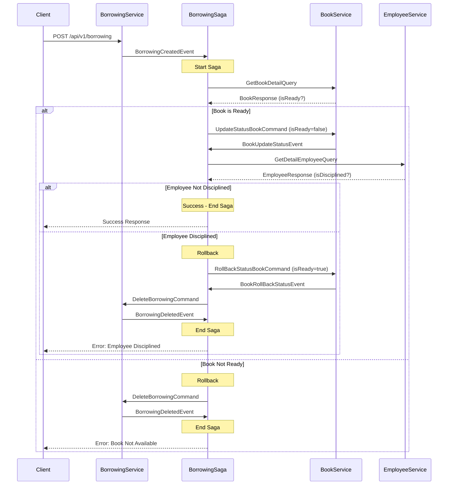
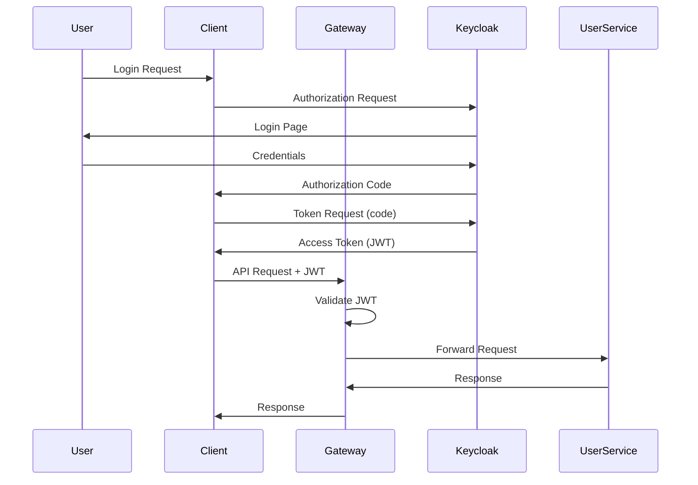

# 📘 TECHNICAL INSTRUCTION - Hệ Thống Quản Lý Thư Viện Microservice

## 📑 Mục Lục

1. [Tổng Quan Kiến Trúc](#1-tổng-quan-kiến-trúc)
2. [Chi Tiết Các Microservices](#2-chi-tiết-các-microservices)
3. [Event Sourcing & CQRS Implementation](#3-event-sourcing--cqrs-implementation)
4. [Saga Pattern - Distributed Transaction](#4-saga-pattern---distributed-transaction)
5. [API Gateway & Service Discovery](#5-api-gateway--service-discovery)
6. [Message Broker & Event Streaming](#6-message-broker--event-streaming)
7. [Security & Authentication](#7-security--authentication)
8. [Database Design](#8-database-design)
9. [Configuration Details](#9-configuration-details)
10. [Deployment Architecture](#10-deployment-architecture)

---

## 1. Tổng Quan Kiến Trúc

### 1.1 Architectural Patterns

Hệ thống áp dụng các pattern sau:

#### **Microservices Architecture**

- Mỗi service là một ứng dụng độc lập, có database riêng
- Communication giữa services thông qua events (asynchronous) và queries (synchronous)
- Loose coupling, high cohesion

#### **CQRS (Command Query Responsibility Segregation)**

- **Command Side:** Xử lý write operations (Create, Update, Delete)
  - Sử dụng Aggregates để đảm bảo business rules
  - Tạo ra Domain Events khi state thay đổi
  - Events được lưu vào Event Store (Axon Server)
- **Query Side:** Xử lý read operations
  - Projection models tối ưu cho queries
  - Event Handlers cập nhật read models khi nhận events
  - Eventual consistency

#### **Event Sourcing**

- Thay vì lưu current state, lưu trữ sequence of events
- Mọi thay đổi state đều là một event
- Có thể rebuild state bằng cách replay events
- Audit trail đầy đủ

#### **Saga Pattern**

- Quản lý distributed transactions
- Compensating transactions khi có lỗi
- Orchestration-based saga với BorrowingSaga

### 1.2 Technology Stack Details

| Layer                 | Technology             | Version | Purpose                         |
| --------------------- | ---------------------- | ------- | ------------------------------- |
| **Framework**         | Spring Boot            | 3.3.1   | Application framework           |
| **Language**          | Java                   | 17      | Programming language            |
| **Build Tool**        | Maven                  | -       | Dependency & build management   |
| **Event Sourcing**    | Axon Framework         | 4.9.3   | CQRS & Event Sourcing framework |
| **Event Store**       | Axon Server            | latest  | Event storage & message routing |
| **Message Broker**    | Apache Kafka           | 7.7.0   | Event streaming platform        |
| **Service Discovery** | Netflix Eureka         | -       | Service registry                |
| **API Gateway**       | Spring Cloud Gateway   | -       | API routing & filtering         |
| **Cache**             | Redis                  | latest  | Rate limiting & caching         |
| **Database (Dev)**    | H2                     | -       | In-memory database              |
| **Database (Prod)**   | MySQL                  | -       | Persistent database             |
| **ORM**               | Spring Data JPA        | -       | Database abstraction            |
| **Security**          | Spring Security OAuth2 | -       | Authentication & authorization  |
| **Identity Provider** | Keycloak               | -       | OAuth2/OIDC provider            |

---

## 2. Chi Tiết Các Microservices

### 2.1 Discovery Server (Eureka)

**Port:** 8761  
**Purpose:** Service registry và discovery

**Cấu hình:**

```properties
# application.properties
server.port=8761
eureka.client.register-with-eureka=false
eureka.client.fetch-registry=false
```

**Chức năng:**

- Service registration: Các services tự động đăng ký khi khởi động
- Health checking: Kiểm tra health của services định kỳ
- Service discovery: Cung cấp thông tin service locations cho clients
- Load balancing: Client-side load balancing thông qua service registry

**Dashboard:** http://localhost:8761

---

### 2.2 API Gateway

**Port:** 8080  
**Purpose:** Single entry point, routing, security, rate limiting

**Dependencies:**

- `spring-cloud-starter-gateway` - Reactive gateway
- `spring-cloud-starter-netflix-eureka-client` - Service discovery
- `spring-boot-starter-data-redis-reactive` - Rate limiting
- `spring-boot-starter-oauth2-resource-server` - JWT validation

**Routing Configuration:**

```yaml
spring:
  cloud:
    gateway:
      routes:
        # Employee Service Route
        - id: employeeservice
          uri: lb://employeeservice # Load-balanced URI from Eureka
          predicates:
            - Path=/api/v1/employees/**
          filters:
            - name: RequestRateLimiter
              args:
                redis-rate-limiter.replenishRate: 10 # 10 tokens/second
                redis-rate-limiter.burstCapacity: 20 # Max 20 tokens
                redis-rate-limiter.requestedTokens: 1 # 1 token per request
            - KeyAuthFilter # Custom authentication filter

        # Book Service Route
        - id: bookservice
          uri: lb://bookservice
          predicates:
            - Path=/api/v1/books/**
          filters:
            - name: RequestRateLimiter
              args:
                redis-rate-limiter.replenishRate: 10
                redis-rate-limiter.burstCapacity: 20
                redis-rate-limiter.requestedTokens: 1
            - KeyAuthFilter

        # User Service Route (JWT Protected)
        - id: userservice
          uri: http://localhost:9005
          predicates:
            - Path=/api/v1/users/**
          filters:
            - name: JwtHeaderFilter

        # User Service Public Route
        - id: userservice-public
          uri: http://localhost:9005
          predicates:
            - Path=/api/v1/public/**
```

**Security Configuration:**

```yaml
spring:
  security:
    oauth2:
      resourceserver:
        jwt:
          issuer-uri: http://localhost:8180/realms/ltfullstack
```

**Rate Limiting Strategy:**

- **Token Bucket Algorithm** thông qua Redis
- **Replenish Rate:** 10 requests/second
- **Burst Capacity:** 20 requests (cho phép burst traffic)
- **Per-user rate limiting** (có thể cấu hình thêm)

---

### 2.3 Book Service

**Port:** 9001  
**Purpose:** Quản lý sách với CQRS và Event Sourcing

**Dependencies:**

- `spring-boot-starter-data-jpa` - Database access
- `spring-boot-starter-web` - REST API
- `axon-spring-boot-starter` - Event sourcing framework
- `h2` - In-memory database
- `spring-boot-starter-validation` - Input validation

**Database Configuration:**

```properties
spring.datasource.url=jdbc:h2:mem:bookDB
spring.datasource.driverClassName=org.h2.Driver
spring.datasource.username=sa
spring.datasource.password=
spring.jpa.database-platform=org.hibernate.dialect.H2Dialect
spring.h2.console.enabled=true
spring.jpa.hibernate.ddl-auto=update
```

**Axon Configuration:**

```properties
axon.axonserver.servers=axonserver:8124
```

#### 2.3.1 Command Side

**BookAggregate:**

```java
@Aggregate
public class BookAggregate {
    @AggregateIdentifier
    private String id;
    private String name;
    private String author;
    private Boolean isReady;

    // Command Handlers
    @CommandHandler
    public BookAggregate(CreateBookCommand command) {
        // Validate business rules
        // Create and apply event
        BookCreatedEvent event = new BookCreatedEvent();
        BeanUtils.copyProperties(command, event);
        AggregateLifecycle.apply(event);
    }

    @CommandHandler
    public void handle(UpdateBookCommand command) {
        BookUpdatedEvent event = new BookUpdatedEvent();
        BeanUtils.copyProperties(command, event);
        AggregateLifecycle.apply(event);
    }

    @CommandHandler
    public void handle(UpdateStatusBookCommand command) {
        // Được gọi từ BorrowingSaga
        BookUpdateStatusEvent event = new BookUpdateStatusEvent();
        BeanUtils.copyProperties(command, event);
        AggregateLifecycle.apply(event);
    }

    @CommandHandler
    public void handle(RollBackStatusBookCommand command) {
        // Rollback khi saga thất bại
        BookRollBackStatusEvent event = new BookRollBackStatusEvent();
        BeanUtils.copyProperties(command, event);
        AggregateLifecycle.apply(event);
    }

    // Event Sourcing Handlers
    @EventSourcingHandler
    public void on(BookCreatedEvent event) {
        this.id = event.getId();
        this.name = event.getName();
        this.author = event.getAuthor();
        this.isReady = true;  // Sách mới luôn sẵn sàng
    }

    @EventSourcingHandler
    public void on(BookUpdateStatusEvent event) {
        this.isReady = event.getIsReady();
    }
}
```

**Commands:**

- `CreateBookCommand(id, name, author, isReady)`
- `UpdateBookCommand(id, name, author, isReady)`
- `DeleteBookCommand(id)`
- `UpdateStatusBookCommand(bookId, isReady, employeeId, borrowingId)` - Từ Saga
- `RollBackStatusBookCommand(bookId, isReady, employeeId, borrowingId)` - Từ Saga

**Events:**

- `BookCreatedEvent`
- `BookUpdatedEvent`
- `BookDeletedEvent`
- `BookUpdateStatusEvent` - Shared event trong commonservice
- `BookRollBackStatusEvent` - Shared event trong commonservice

#### 2.3.2 Query Side

**BookProjection:**

- Event Handler lắng nghe events và cập nhật read database
- Tối ưu cho query operations
- Có thể có nhiều projections khác nhau cho các use cases khác nhau

**REST Controller:**

```java
@RestController
@RequestMapping("/api/v1/books")
public class BookCommandController {
    @Autowired
    private CommandGateway commandGateway;

    @PostMapping
    public String addBook(@Valid @RequestBody BookRequestModel model) {
        CreateBookCommand command = new CreateBookCommand(
            UUID.randomUUID().toString(),
            model.getName(),
            model.getAuthor(),
            true
        );
        return commandGateway.sendAndWait(command);
    }

    @PutMapping("/{bookId}")
    public String updateBook(@RequestBody BookRequestModel model,
                            @PathVariable String bookId) {
        UpdateBookCommand command = new UpdateBookCommand(
            bookId,
            model.getName(),
            model.getAuthor(),
            model.getIsReady()
        );
        return commandGateway.sendAndWait(command);
    }

    @DeleteMapping("/{bookId}")
    public String deleteBook(@PathVariable String bookId) {
        DeleteBookCommand command = new DeleteBookCommand(bookId);
        return commandGateway.sendAndWait(command);
    }
}
```

---

### 2.4 Employee Service

**Port:** 9002  
**Purpose:** Quản lý nhân viên với CQRS

**Tương tự Book Service với:**

- `EmployeeAggregate`
- Commands: Create, Update, Delete
- Events: EmployeeCreated, EmployeeUpdated, EmployeeDeleted
- Query side với projection

**Đặc điểm riêng:**

- Field `isDisciplined` để kiểm tra trạng thái kỷ luật
- Được query bởi BorrowingSaga để validate điều kiện mượn sách

**API Documentation:**

- Tích hợp SpringDoc OpenAPI
- Swagger UI: http://localhost:9002/swagger-ui.html

---

### 2.5 Borrowing Service

**Port:** 9003  
**Purpose:** Quản lý quy trình mượn sách với Saga Pattern

**Dependencies:**

- Tương tự Book Service
- Thêm dependency vào commonservice để sử dụng shared commands/events

#### 2.5.1 BorrowingAggregate

```java
@Aggregate
public class BorrowingAggregate {
    @AggregateIdentifier
    private String id;
    private String bookId;
    private String employeeId;
    private Date borrowingDate;
    private Date returnDate;

    @CommandHandler
    public BorrowingAggregate(CreateBorrowingCommand command) {
        BorrowingCreatedEvent event = new BorrowingCreatedEvent();
        BeanUtils.copyProperties(command, event);
        AggregateLifecycle.apply(event);
    }

    @CommandHandler
    public void handle(DeleteBorrowingCommand command) {
        // Được gọi khi saga rollback
        BorrowingDeletedEvent event = new BorrowingDeletedEvent(command.getId());
        AggregateLifecycle.apply(event);
    }
}
```

#### 2.5.2 BorrowingSaga - Core Business Logic

**Saga Lifecycle:**

```java
@Saga
@Slf4j
public class BorrowingSaga {
    @Autowired
    private transient CommandGateway commandGateway;

    @Autowired
    private transient QueryGateway queryGateway;

    // Step 1: Bắt đầu Saga khi có BorrowingCreatedEvent
    @StartSaga
    @SagaEventHandler(associationProperty = "id")
    private void handle(BorrowingCreatedEvent event) {
        log.info("BorrowingCreatedEvent in saga for BookId: " + event.getBookId()
                 + " : EmployeeId: " + event.getEmployeeId());
        try {
            // Query book details
            GetBookDetailQuery query = new GetBookDetailQuery(event.getBookId());
            BookResponseCommonModel book = queryGateway
                .query(query, ResponseTypes.instanceOf(BookResponseCommonModel.class))
                .join();

            // Business Rule 1: Kiểm tra sách có sẵn không
            if (!book.getIsReady()) {
                throw new Exception("Sách đã có người mượn");
            } else {
                // Associate saga với bookId để nhận BookUpdateStatusEvent
                SagaLifecycle.associateWith("bookId", event.getBookId());

                // Send command để update book status
                UpdateStatusBookCommand command = new UpdateStatusBookCommand(
                    event.getBookId(),
                    false,  // Set isReady = false
                    event.getEmployeeId(),
                    event.getId()
                );
                commandGateway.sendAndWait(command);
            }
        } catch (Exception ex) {
            // Rollback: Xóa borrowing record
            rollbackBorrowingRecord(event.getId());
            log.error(ex.getMessage());
        }
    }

    // Step 2: Xử lý khi book status đã được update
    @SagaEventHandler(associationProperty = "bookId")
    private void handler(BookUpdateStatusEvent event) {
        log.info("BookUpdateStatusEvent in Saga for BookId : " + event.getBookId());
        try {
            // Query employee details
            GetDetailEmployeeQuery query = new GetDetailEmployeeQuery(event.getEmployeeId());
            EmployeeResponseCommonModel employee = queryGateway
                .query(query, ResponseTypes.instanceOf(EmployeeResponseCommonModel.class))
                .join();

            // Business Rule 2: Kiểm tra nhân viên có bị kỷ luật không
            if (employee.getIsDisciplined()) {
                throw new Exception("Nhân viên bị kỉ luật");
            } else {
                log.info("Đã mượn sách thành công");
                SagaLifecycle.end();  // Kết thúc saga thành công
            }
        } catch (Exception ex) {
            // Rollback: Hoàn trả book status và xóa borrowing
            rollBackBookStatus(event.getBookId(), event.getEmployeeId(), event.getBorrowingId());
            log.error(ex.getMessage());
        }
    }

    // Step 3: Xử lý rollback book status
    @SagaEventHandler(associationProperty = "bookId")
    private void handle(BookRollBackStatusEvent event) {
        log.info("BookRollBackStatusEvent in Saga for book Id : " + event.getBookId());
        rollbackBorrowingRecord(event.getBorrowingId());
    }

    // Step 4: Kết thúc saga khi borrowing bị xóa
    @SagaEventHandler(associationProperty = "id")
    @EndSaga
    private void handle(BorrowingDeletedEvent event) {
        log.info("BorrowDeletedEvent in Saga for Borrowing Id : " + event.getId());
        SagaLifecycle.end();
    }

    // Helper methods
    private void rollbackBorrowingRecord(String id) {
        DeleteBorrowingCommand command = new DeleteBorrowingCommand(id);
        commandGateway.sendAndWait(command);
    }

    private void rollBackBookStatus(String bookId, String employeeId, String borrowingId) {
        SagaLifecycle.associateWith("bookId", bookId);
        RollBackStatusBookCommand command = new RollBackStatusBookCommand(
            bookId,
            true,  // Set isReady = true (hoàn trả)
            employeeId,
            borrowingId
        );
        commandGateway.sendAndWait(command);
    }
}
```

**Saga Flow Diagram:**



**Business Rules:**

1. Sách phải ở trạng thái `isReady = true` (có sẵn)
2. Nhân viên không được bị kỷ luật (`isDisciplined = false`)
3. Nếu vi phạm bất kỳ rule nào → Rollback toàn bộ transaction

---

### 2.6 User Service

**Port:** 9005  
**Purpose:** Authentication và quản lý người dùng

**Dependencies:**

- `spring-boot-starter-data-jpa`
- `spring-cloud-starter-openfeign` - Gọi APIs của services khác
- `mysql-connector-j` - MySQL database

**Database:** MySQL (persistent storage)

**Endpoints:**

- `/api/v1/users/**` - Protected với JWT
- `/api/v1/public/**` - Public endpoints

**Feign Client:**
Sử dụng OpenFeign để gọi APIs của các services khác một cách declarative.

---

### 2.7 Notification Service

**Port:** 9003  
**Purpose:** Gửi email notifications và xử lý Kafka events

**Dependencies:**

- `spring-kafka` - Kafka consumer
- `spring-boot-starter-mail` - Email sending
- `spring-boot-starter-freemarker` - Email templates
- `commonservice` - Shared utilities

**Kafka Consumer:**
Lắng nghe events từ Kafka topics và gửi email notifications tương ứng.

**Email Service:**

```java
@Service
public class EmailService {
    @Autowired
    private JavaMailSender mailSender;

    @Autowired
    private Configuration freemarkerConfig;

    public void sendEmail(String to, String subject, String templateName, Map<String, Object> model) {
        // Load FreeMarker template
        // Populate template with model data
        // Send email via SMTP
    }
}
```

---

### 2.8 Common Service

**Purpose:** Shared components, commands, events, queries

**Không phải standalone service**, mà là shared library được import bởi các services khác.

**Structure:**

```
commonservice/
├── command/
│   ├── UpdateStatusBookCommand.java
│   └── RollBackStatusBookCommand.java
├── event/
│   ├── BookUpdateStatusEvent.java
│   └── BookRollBackStatusEvent.java
├── model/
│   ├── BookResponseCommonModel.java
│   ├── EmployeeResponseCommonModel.java
│   └── Message.java
├── queries/
│   ├── GetBookDetailQuery.java
│   └── GetDetailEmployeeQuery.java
├── services/
│   ├── EmailService.java
│   └── KafkaService.java
└── configuration/
    ├── AxonConfig.java
    └── KafkaConfig.java
```

**KafkaService:**

```java
@Service
@Slf4j
public class KafkaService {
    @Autowired
    private KafkaTemplate<String, String> kafkaTemplate;

    public void sendMessage(String topic, String message) {
        kafkaTemplate.send(topic, message);
        log.info("Message send to topic: " + topic);
    }
}
```

---

## 3. Event Sourcing & CQRS Implementation

### 3.1 Axon Framework Architecture

**Axon Server Components:**

- **Event Store:** Lưu trữ tất cả events
- **Message Router:** Routing commands, events, queries giữa các services
- **Snapshot Store:** Lưu snapshots của aggregates để tối ưu performance

**Ports:**

- 8024: HTTP API & Dashboard
- 8124: gRPC communication
- 8224: Internal communication

### 3.2 Command Flow

```
Client Request
    ↓
REST Controller
    ↓
CommandGateway.sendAndWait(command)
    ↓
Axon Server (routing)
    ↓
@CommandHandler in Aggregate
    ↓
Business Logic Validation
    ↓
AggregateLifecycle.apply(event)
    ↓
Event Store (persist event)
    ↓
@EventSourcingHandler (update aggregate state)
    ↓
Event Bus (publish event)
    ↓
Event Handlers / Saga Handlers
    ↓
Update Read Models / Trigger Saga Steps
```

### 3.3 Query Flow

```
Client Request
    ↓
REST Controller
    ↓
QueryGateway.query(query, responseType)
    ↓
Axon Server (routing)
    ↓
@QueryHandler in Projection
    ↓
Query Read Database
    ↓
Return Response
```

### 3.4 Event Sourcing Benefits

1. **Complete Audit Trail:** Mọi thay đổi đều được ghi lại
2. **Temporal Queries:** Có thể query state tại bất kỳ thời điểm nào
3. **Event Replay:** Rebuild state từ events
4. **Debugging:** Dễ dàng debug bằng cách xem event history
5. **Analytics:** Phân tích business events

### 3.5 CQRS Benefits

1. **Scalability:** Scale read và write independently
2. **Performance:** Optimize read models cho specific queries
3. **Flexibility:** Nhiều read models cho các use cases khác nhau
4. **Separation of Concerns:** Business logic tách biệt với query logic

---

## 4. Saga Pattern - Distributed Transaction

### 4.1 Saga Pattern Overview

**Problem:** Làm sao đảm bảo data consistency trong distributed system khi một business transaction span across multiple services?

**Solution:** Saga Pattern - Sequence of local transactions với compensating transactions.

### 4.2 BorrowingSaga Implementation Details

**Saga State Management:**

- Axon Framework tự động quản lý saga state
- State được persist trong Axon Server
- Saga có thể resume sau khi service restart

**Association Properties:**

- `id` - BorrowingId (primary association)
- `bookId` - Để nhận events từ BookService

**Saga Lifecycle:**

1. `@StartSaga` - Bắt đầu saga instance mới
2. `@SagaEventHandler` - Xử lý events và trigger next steps
3. `@EndSaga` - Kết thúc saga (success hoặc failure)

**Compensating Transactions:**

- `DeleteBorrowingCommand` - Xóa borrowing record
- `RollBackStatusBookCommand` - Hoàn trả book status

### 4.3 Saga vs 2PC (Two-Phase Commit)

| Aspect               | Saga                        | 2PC            |
| -------------------- | --------------------------- | -------------- |
| **Coupling**         | Loose                       | Tight          |
| **Availability**     | High                        | Low (blocking) |
| **Consistency**      | Eventual                    | Immediate      |
| **Complexity**       | Higher (compensating logic) | Lower          |
| **Performance**      | Better                      | Worse (locks)  |
| **Failure Handling** | Compensating transactions   | Rollback       |

**Kết luận:** Saga phù hợp hơn cho microservices architecture.

---

## 5. API Gateway & Service Discovery

### 5.1 Spring Cloud Gateway Features

**Reactive & Non-blocking:**

- Built on Spring WebFlux
- High performance, low latency
- Efficient resource utilization

**Route Matching:**

- Path-based routing
- Header-based routing
- Method-based routing
- Custom predicates

**Filters:**

- Pre-filters: Modify request trước khi forward
- Post-filters: Modify response trước khi return
- Global filters: Apply cho tất cả routes
- Route-specific filters

**Built-in Filters:**

- `RequestRateLimiter` - Rate limiting
- `AddRequestHeader` - Add headers
- `RewritePath` - URL rewriting
- `CircuitBreaker` - Resilience
- `Retry` - Retry logic

### 5.2 Rate Limiting Implementation

**Algorithm:** Token Bucket

**Configuration:**

```yaml
filters:
  - name: RequestRateLimiter
    args:
      redis-rate-limiter.replenishRate: 10 # Tokens added per second
      redis-rate-limiter.burstCapacity: 20 # Max tokens in bucket
      redis-rate-limiter.requestedTokens: 1 # Tokens per request
```

**How it works:**

1. Mỗi user có một bucket với capacity = 20 tokens
2. Bucket được refill với rate = 10 tokens/second
3. Mỗi request consume 1 token
4. Nếu không đủ tokens → HTTP 429 (Too Many Requests)

**Redis Keys:**

```
request_rate_limiter.{user}.tokens
request_rate_limiter.{user}.timestamp
```

### 5.3 Service Discovery với Eureka

**Registration:**

```java
@EnableEurekaClient
@SpringBootApplication
public class BookServiceApplication {
    public static void main(String[] args) {
        SpringApplication.run(BookServiceApplication.class, args);
    }
}
```

**Configuration:**

```properties
eureka.client.service-url.defaultZone=http://discoveryserver:8761/eureka
eureka.instance.hostname=localhost
```

**Load Balancing:**

- Gateway sử dụng `lb://` scheme
- Eureka cung cấp list of instances
- Ribbon (hoặc Spring Cloud LoadBalancer) chọn instance
- Round-robin algorithm (default)

---

## 6. Message Broker & Event Streaming

### 6.1 Apache Kafka Architecture

**Components:**

- **Broker:** Kafka server (port 9092)
- **Zookeeper:** Cluster coordination (port 2181)
- **Control Center:** Monitoring UI (port 9021)

**Topics:**

- Logical channels cho messages
- Partitioned và replicated
- Ordered within partition

**Producers:**

- Services gửi messages vào topics
- Asynchronous by default

**Consumers:**

- Services đọc messages từ topics
- Consumer groups cho load balancing

### 6.2 Kafka Configuration

**Broker Configuration:**

```yaml
KAFKA_BROKER_ID: 1
KAFKA_ZOOKEEPER_CONNECT: "zookeeper:2181"
KAFKA_ADVERTISED_LISTENERS: PLAINTEXT://broker:29092,PLAINTEXT_HOST://broker:9092
KAFKA_OFFSETS_TOPIC_REPLICATION_FACTOR: 1
KAFKA_TRANSACTION_STATE_LOG_REPLICATION_FACTOR: 1
```

**Producer Configuration (trong services):**

```properties
spring.kafka.bootstrap-servers=broker:9092
spring.kafka.producer.key-serializer=org.apache.kafka.common.serialization.StringSerializer
spring.kafka.producer.value-serializer=org.apache.kafka.common.serialization.StringSerializer
```

**Consumer Configuration:**

```properties
spring.kafka.consumer.group-id=notification-service
spring.kafka.consumer.auto-offset-reset=earliest
spring.kafka.consumer.key-deserializer=org.apache.kafka.common.serialization.StringDeserializer
spring.kafka.consumer.value-deserializer=org.apache.kafka.common.serialization.StringDeserializer
```

### 6.3 Kafka vs Axon Server

| Aspect            | Kafka                   | Axon Server               |
| ----------------- | ----------------------- | ------------------------- |
| **Purpose**       | General event streaming | CQRS/ES specific          |
| **Message Types** | Events only             | Commands, Events, Queries |
| **Event Store**   | No (log-based)          | Yes (optimized for ES)    |
| **Routing**       | Topic-based             | Type-based + routing keys |
| **Ordering**      | Per partition           | Per aggregate             |
| **Use Case**      | Integration events      | Domain events             |

**Trong dự án này:**

- **Axon Server:** Domain events giữa aggregates và sagas
- **Kafka:** Integration events, notifications, external systems

---

## 7. Security & Authentication

### 7.1 OAuth2 / OpenID Connect Flow



### 7.2 JWT Token Structure

**Header:**

```json
{
  "alg": "RS256",
  "typ": "JWT",
  "kid": "key-id"
}
```

**Payload:**

```json
{
  "sub": "user-id",
  "iss": "http://localhost:8180/realms/ltfullstack",
  "aud": "account",
  "exp": 1234567890,
  "iat": 1234567800,
  "roles": ["user", "admin"],
  "email": "user@example.com"
}
```

**Signature:**

```
RSASHA256(
  base64UrlEncode(header) + "." +
  base64UrlEncode(payload),
  privateKey
)
```

### 7.3 Gateway Security Configuration

**JWT Validation:**

```java
@Configuration
public class SecurityConfig {
    @Bean
    public SecurityWebFilterChain springSecurityFilterChain(ServerHttpSecurity http) {
        http
            .authorizeExchange(exchanges -> exchanges
                .pathMatchers("/api/v1/public/**").permitAll()
                .pathMatchers("/api/v1/users/**").authenticated()
                .anyExchange().authenticated()
            )
            .oauth2ResourceServer(oauth2 -> oauth2
                .jwt(jwt -> jwt
                    .jwtAuthenticationConverter(jwtAuthenticationConverter())
                )
            );
        return http.build();
    }
}
```

### 7.4 Custom Filters

**KeyAuthFilter:**

- Xác thực requests đến Book và Employee services
- Có thể implement API key authentication
- Header-based hoặc query parameter-based

**JwtHeaderFilter:**

- Extract JWT từ Authorization header
- Validate token signature
- Extract user claims
- Add user context vào request

---

## 8. Database Design

### 8.1 Book Service Database

**Entity:**

```java
@Entity
@Table(name = "books")
public class Book {
    @Id
    private String id;

    @Column(nullable = false)
    private String name;

    @Column(nullable = false)
    private String author;

    @Column(nullable = false)
    private Boolean isReady;

    @CreatedDate
    private LocalDateTime createdAt;

    @LastModifiedDate
    private LocalDateTime updatedAt;
}
```

**Indexes:**

```sql
CREATE INDEX idx_book_ready ON books(isReady);
CREATE INDEX idx_book_name ON books(name);
```

### 8.2 Employee Service Database

**Entity:**

```java
@Entity
@Table(name = "employees")
public class Employee {
    @Id
    private String id;

    @Column(nullable = false)
    private String firstName;

    @Column(nullable = false)
    private String lastName;

    @Column(nullable = false)
    private Boolean isDisciplined;

    @CreatedDate
    private LocalDateTime createdAt;

    @LastModifiedDate
    private LocalDateTime updatedAt;
}
```

**Indexes:**

```sql
CREATE INDEX idx_employee_disciplined ON employees(isDisciplined);
CREATE INDEX idx_employee_name ON employees(firstName, lastName);
```

### 8.3 Borrowing Service Database

**Entity:**

```java
@Entity
@Table(name = "borrowings")
public class Borrowing {
    @Id
    private String id;

    @Column(nullable = false)
    private String bookId;

    @Column(nullable = false)
    private String employeeId;

    @Column(nullable = false)
    @Temporal(TemporalType.TIMESTAMP)
    private Date borrowingDate;

    @Temporal(TemporalType.TIMESTAMP)
    private Date returnDate;

    @Enumerated(EnumType.STRING)
    private BorrowingStatus status;  // ACTIVE, RETURNED, OVERDUE
}
```

**Indexes:**

```sql
CREATE INDEX idx_borrowing_book ON borrowings(bookId);
CREATE INDEX idx_borrowing_employee ON borrowings(employeeId);
CREATE INDEX idx_borrowing_date ON borrowings(borrowingDate);
CREATE INDEX idx_borrowing_status ON borrowings(status);
```

### 8.4 Event Store (Axon Server)

**Event Entry Table:**

```sql
CREATE TABLE domain_event_entry (
    global_index BIGINT AUTO_INCREMENT PRIMARY KEY,
    event_identifier VARCHAR(255) NOT NULL UNIQUE,
    aggregate_identifier VARCHAR(255) NOT NULL,
    sequence_number BIGINT NOT NULL,
    type VARCHAR(255) NOT NULL,
    timestamp VARCHAR(255) NOT NULL,
    payload_type VARCHAR(255) NOT NULL,
    payload BLOB NOT NULL,
    meta_data BLOB,
    UNIQUE KEY (aggregate_identifier, sequence_number)
);
```

**Snapshot Entry Table:**

```sql
CREATE TABLE snapshot_event_entry (
    aggregate_identifier VARCHAR(255) NOT NULL,
    sequence_number BIGINT NOT NULL,
    type VARCHAR(255) NOT NULL,
    timestamp VARCHAR(255) NOT NULL,
    payload_type VARCHAR(255) NOT NULL,
    payload BLOB NOT NULL,
    meta_data BLOB,
    PRIMARY KEY (aggregate_identifier, sequence_number)
);
```

---

## 9. Configuration Details

### 9.1 Environment-Specific Configuration

**Development (Local):**

```properties
# Discovery Server
eureka.client.service-url.defaultZone=http://localhost:8761/eureka

# Axon Server
axon.axonserver.servers=localhost:8124

# Kafka
spring.kafka.bootstrap-servers=localhost:9092

# Redis
spring.redis.host=localhost
spring.redis.port=6379
```

**Docker Compose:**

```properties
# Discovery Server
eureka.client.service-url.defaultZone=http://discoveryserver:8761/eureka

# Axon Server
axon.axonserver.servers=axonserver:8124

# Kafka
spring.kafka.bootstrap-servers=broker:9092

# Redis
spring.redis.host=redis
spring.redis.port=6379
```

**Kubernetes:**

```yaml
# Service discovery via K8s DNS
eureka.client.service-url.defaultZone=http://discovery-server-service:8761/eureka

# Axon Server
axon.axonserver.servers=axon-server-service:8124
```

### 9.2 JPA Configuration

```properties
# Hibernate Settings
spring.jpa.hibernate.ddl-auto=update  # Dev: update, Prod: validate
spring.jpa.show-sql=true              # Dev: true, Prod: false
spring.jpa.properties.hibernate.format_sql=true
spring.jpa.properties.hibernate.dialect=org.hibernate.dialect.H2Dialect

# Connection Pool (HikariCP)
spring.datasource.hikari.maximum-pool-size=10
spring.datasource.hikari.minimum-idle=5
spring.datasource.hikari.connection-timeout=30000
```

### 9.3 Logging Configuration

```properties
# Root Logger
logging.level.root=INFO

# Application Loggers
logging.level.com.ltfullstack=DEBUG

# Framework Loggers
logging.level.org.springframework.web=DEBUG
logging.level.org.axonframework=DEBUG
logging.level.org.hibernate.SQL=DEBUG
logging.level.org.hibernate.type.descriptor.sql.BasicBinder=TRACE

# Log File
logging.file.name=logs/application.log
logging.file.max-size=10MB
logging.file.max-history=30
```

---

## 10. Deployment Architecture

### 10.1 Docker Deployment

**Build Images:**

```bash
# Build all services
docker-compose build

# Build specific service
docker build -t bookservice:latest -f bookservice/Dockerfile .
```

**Docker Compose Deployment:**

```bash
# Start infrastructure
docker-compose -f docker-compose-provider.yml up -d

# Start all services
docker-compose up -d

# View logs
docker-compose logs -f bookservice

# Scale service
docker-compose up -d --scale bookservice=3
```

### 10.2 Kubernetes Deployment

**Deployment Manifest:**

```yaml
apiVersion: apps/v1
kind: Deployment
metadata:
  name: bookservice
spec:
  replicas: 3
  selector:
    matchLabels:
      app: bookservice
  template:
    metadata:
      labels:
        app: bookservice
    spec:
      containers:
        - name: bookservice
          image: your-registry/bookservice:latest
          ports:
            - containerPort: 9001
          env:
            - name: SPRING_PROFILES_ACTIVE
              value: "kubernetes"
            - name: EUREKA_CLIENT_SERVICEURL_DEFAULTZONE
              value: "http://discovery-server-service:8761/eureka"
          resources:
            requests:
              memory: "512Mi"
              cpu: "500m"
            limits:
              memory: "1Gi"
              cpu: "1000m"
          livenessProbe:
            httpGet:
              path: /actuator/health
              port: 9001
            initialDelaySeconds: 60
            periodSeconds: 10
          readinessProbe:
            httpGet:
              path: /actuator/health
              port: 9001
            initialDelaySeconds: 30
            periodSeconds: 5
```

**Service Manifest:**

```yaml
apiVersion: v1
kind: Service
metadata:
  name: bookservice
spec:
  selector:
    app: bookservice
  ports:
    - protocol: TCP
      port: 9001
      targetPort: 9001
  type: ClusterIP
```

### 10.3 Production Considerations

**High Availability:**

- Multiple replicas cho mỗi service (minimum 3)
- Load balancing với Kubernetes Service hoặc External LB
- Health checks và auto-restart

**Monitoring:**

- Spring Boot Actuator endpoints
- Prometheus metrics export
- Grafana dashboards
- ELK Stack cho centralized logging
- Distributed tracing với Sleuth + Zipkin

**Security:**

- TLS/SSL cho tất cả communications
- Network policies trong Kubernetes
- Secret management (Vault, K8s Secrets)
- Regular security updates

**Performance:**

- Database connection pooling
- Redis caching strategy
- Axon Server snapshots
- Query optimization
- CDN cho static content

**Backup & Recovery:**

- Database backups (automated)
- Event store backups
- Disaster recovery plan
- Point-in-time recovery capability

---

## 📚 Tài Liệu Tham Khảo

### Official Documentation

- [Spring Boot Documentation](https://spring.io/projects/spring-boot)
- [Axon Framework Reference Guide](https://docs.axoniq.io/reference-guide/)
- [Spring Cloud Gateway](https://spring.io/projects/spring-cloud-gateway)
- [Apache Kafka Documentation](https://kafka.apache.org/documentation/)
- [Netflix Eureka](https://github.com/Netflix/eureka/wiki)

### Design Patterns

- [Microservices Patterns - Chris Richardson](https://microservices.io/patterns/)
- [CQRS Pattern](https://martinfowler.com/bliki/CQRS.html)
- [Event Sourcing](https://martinfowler.com/eaaDev/EventSourcing.html)
- [Saga Pattern](https://microservices.io/patterns/data/saga.html)

### Best Practices

- [12-Factor App](https://12factor.net/)
- [Domain-Driven Design](https://www.domainlanguage.com/ddd/)

---

**Document Version:** 1.0  
**Last Updated:** 2024  
**Author:** LTFullStack - Udemy Instructor
